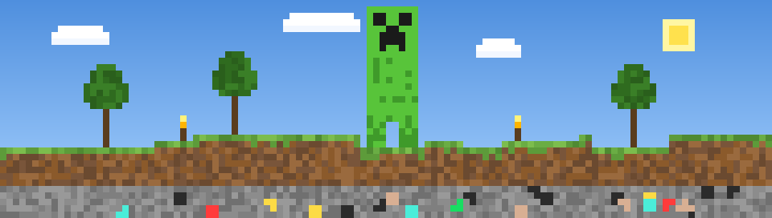
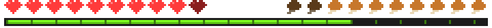
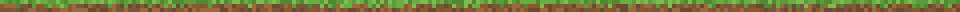
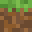

<div align="center">



[](https://github.com/ezybg7)



<br>

[](https://mt-eve.rest)
[](https://www.linkedin.com/in/ezybg7)
[](https://github.com/ezybg7?tab=followers)


</div>

```
[Server] Everett joined the game
[Server] Everett has made the advancement [Full Stack]
<Everett> hey! welcome to my world. grab a pickaxe and look around.
```



##  Mining Stats

<div align="center">

<a href="https://github.com/ezybg7">
  
</a>
<a href="https://github.com/ezybg7">
  
</a>

<a href="https://github.com/ezybg7">
  
</a>

<picture>
  <source media="(prefers-color-scheme: dark)" srcset="https://raw.githubusercontent.com/ezybg7/ezybg7/output/snake.svg">
  <source media="(prefers-color-scheme: light)" srcset="https://raw.githubusercontent.com/ezybg7/ezybg7/output/snake-light.svg">
  
</picture>

</div>


##  Inventory

<div align="center">

**⚔️ Hotbar** · the stuff I reach for first

[](https://skillicons.dev)

<br>

<table>
<tr>
<td align="center" valign="top">

**📜 Languages**

[](https://skillicons.dev)

</td>
<td align="center" valign="top">

**🧱 Frontend & Design**

[](https://skillicons.dev)

</td>
</tr>
<tr>
<td align="center" valign="top">

**⚙️ Backend & Data**

[](https://skillicons.dev)

</td>
<td align="center" valign="top">

**☁️ Cloud & Tools**

[](https://skillicons.dev)

</td>
</tr>
</table>

**✨ Enchantments**


<br>

<a href="https://github.com/ezybg7">
  
</a>

</div>


##  Advancements

<div align="center">

<a href="https://github.com/ezybg7">
  
</a>

</div>


##  Featured Builds

<div align="center">

<a href="https://github.com/ezybg7/gratis-ui">
  
</a>
<a href="https://github.com/ezybg7/learning-hub">
  
</a>

<a href="https://github.com/ezybg7/SEO-Checker">
  
</a>
<a href="https://github.com/ezybg7/Ducks-10-Mans">
  
</a>

<a href="https://github.com/ezybg7/Multishot-LLM-for-Counterspeech-Generation-Evaluator">
  
</a>
<a href="https://github.com/ezybg7/cups-print-server">
  
</a>

<a href="https://github.com/ewbyf/hackku-2025">
  
</a>
<a href="https://github.com/hannahstarlee/boba-talks-community">
  
</a>

</div>


<div align="center">

```
[Server] Everett has made the advancement [Open Source Contributor]
<Everett> thanks for stopping by! gg :)
```


</div>
